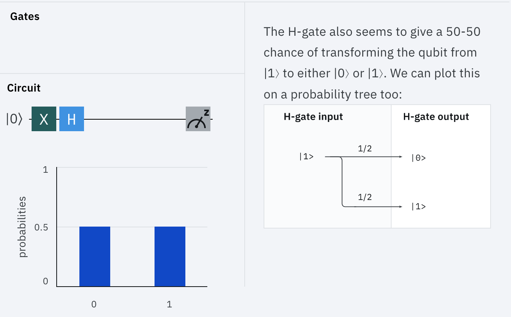
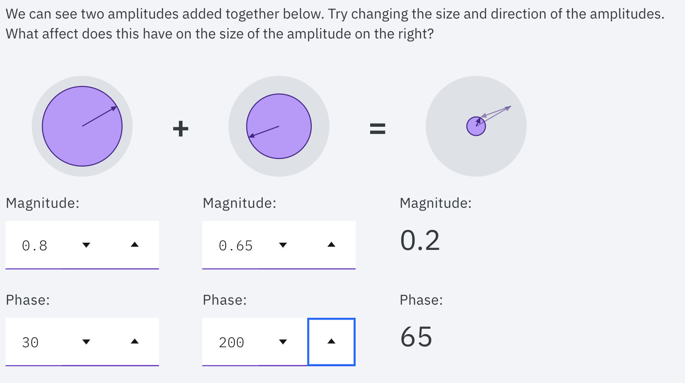
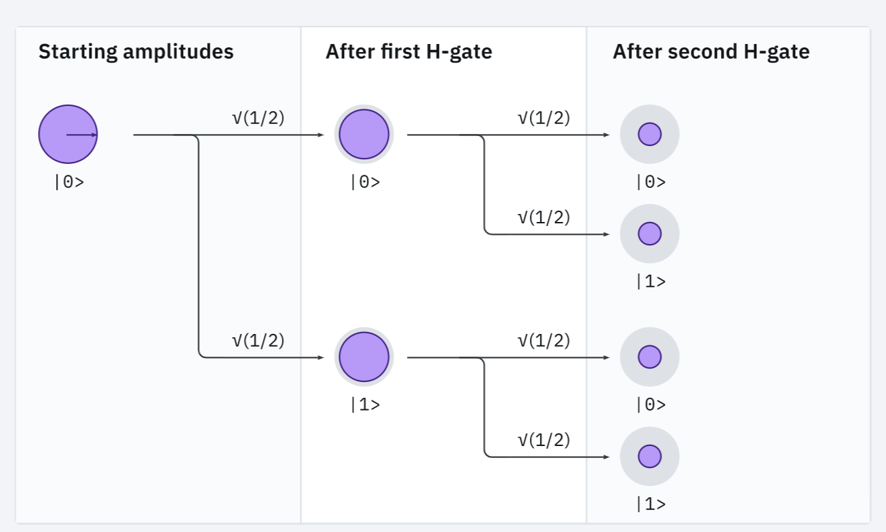
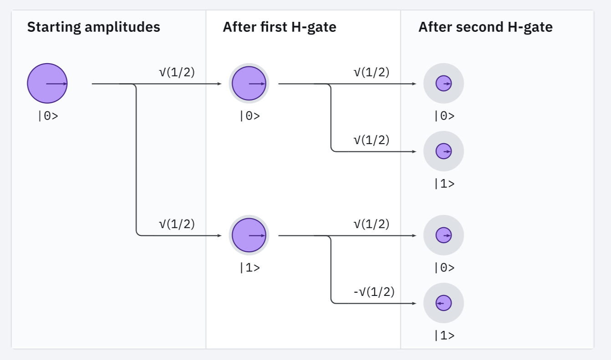
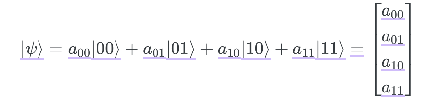
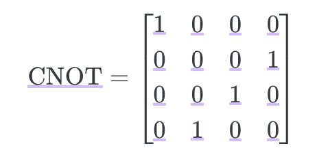
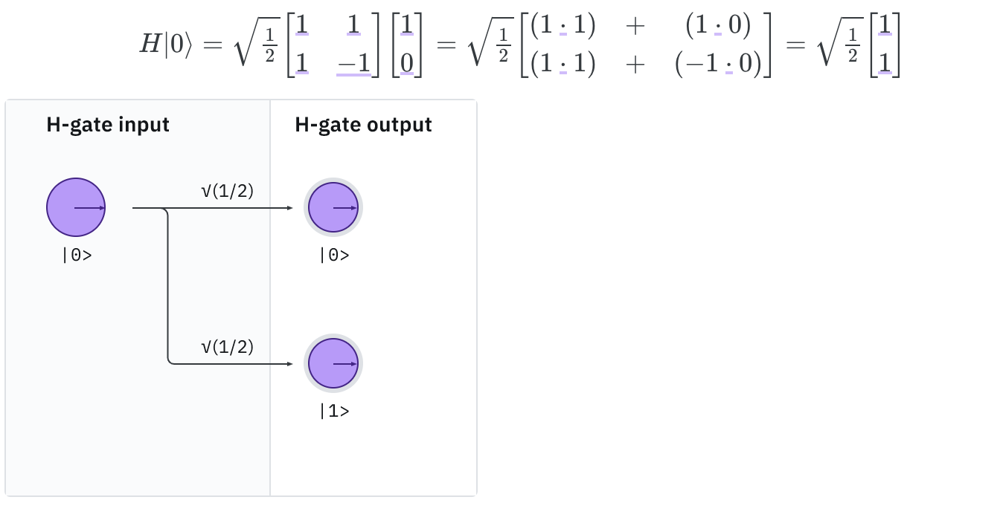
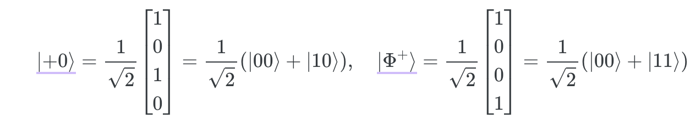

# 1. Introduction to Quantum Computing

## Why Quantum Computing?

Relationship of Input-Algorithm-Output sequence


Significant advantage in complex mathematical problems such as **integer factorization**
*p* $\times$ *q* = *x*
What if the value of *p* and *q* are extremely big?

```python
p = 64135289477071580278790190170577389084825014742943447208116859632024532344630238623598752668347708737661925585694639798853367
q = 33372027594978156556226010605355114227940760344767554666784520987023841729210037080257448673296881877565718986258036932062711

p*q == x  # Evaluates to 'True'
```

Advantages of Quantum computing
- Use of Qubits 
- Quantum Advantage: Since algorithms are measured by their rate of growth, it is advantageous by exponential computational power growth


## Atoms of Computation
### Idea
Instead of bits, we use **qubits** which are more expressive (because they are capable of 2^n combinations using n bits)

### Circuits
For quantum computers, we use the same basic idea but have different conventions for how to represent inputs, outputs, and the symbols used for operations. 
Creating the Quantum circuit is also available. Refer to the file **notes_extension/01_introduction.ipynb**

## Bits?

Origin of Quantum mechanics : They found that really small things like atoms behave differently to the things we interact with in our day-to-day lives, and in certain cases the rules of classical physics weren’t quite right. The physics they had needed modifying, so the scientists came up with a more accurate set of rules which became known as “quantum physics”.

What are Qubits then? - Let’s take a look at a new operation that only acts on quantum bits: the Hadamard gate, which we will call the “H-gate” for short.



One interesting thing is that even with two consecutive H-gate, it doesn't necessary becone 2 * 2 option, but beconme **deterministic**. Two probabilistic operations, applied in sequence, seem to “undo” each other! In fact, this simple behaviour is so unusual we can’t describe it using probability trees. There just aren’t any numbers we can put on our branches that give the correct result in all cases.

Probability is useful when we don't have enough information. To describe quantum mechanics, we can use probability amplitudes. Probability amplitudes are similar to normal probabilities in that:

- amplitudes have a magnitude,
- each possible outcome has a probability amplitude,
- and the magnitude of that outcome's amplitude tells us how likely that outcome is to occur.

But Amplitude also has a **phase** which is the *angle*. 



To convert from Amplitude to Probability, simply square it!

### But why deterministic?

What originally will look like is the following (after 2 H-gates):



But to give a 0% chance of measuring (to explain that at the end of the day it is deterministic), we need the amplitudes on the two branches that lead to  to have opposite phases.



Here is one potential reason why

Alternatively, we can use vectors to simulate and keep track of these qubits. The upper limit for simulating a difficult quantum circuit tends to be somewhere between the 30-40 qubit mark. The amplitude value will be any number between -1~+1

## Describing the quantum computer

We also saw that, for n qubits, there are 2^n possible outcomes, and we can store these amplitudes in lists of length which we call vectors. Since these vectors describe the state of our qubits, we call them “state vectors”.

For example, if the length of vector is 4, then it is $[00 01 10 11]$ positions. If it is the vector state of qubits, then the amplitude is just as is, while the probability is the square of that value.

We call adding quantum states like this **“superposing”** them, so we can say $|x>$ is a superposition of the states $|00>$ and $|01>$.” In fact, it’s convention in quantum computing to define the computational basis states like so:



Since we can write any vector as a combination of these four vectors, we say these four vectors form a basis, which we will call the computational basis.

As of state vectors, We know that we can represent any quantum state using vectors, but is any vector a valid quantum state? In our case, no; since we square our amplitudes to find the probability of outcomes occurring, we need these squares to add to one, otherwise it doesn't make sense.

e.g. $1/sqrt(3) \times [1 -1 1]$ cannot be the the state vector, while $1/sqrt(4) \times [1 -1 1 1]$ can.

Another factor is something we call **"global phases"** of state vector. Since we only know phase exists because of the interference effects it produces, we can only ever measure phase differences. For example, we cannot figure out the difference between $1/sqrt(2) \times [1 0 0 1]$ and $1/sqrt(2) \times [-1 0 0 -1]$. They are same mathematically, but different physically.

An n-qubit state vector can contain up to $2^n$ amplitudes. What’s the largest number of transition amplitudes we’d need to represent any quantum operation on  qubits? : $(2^n)^2$. When expressing the transformation from one state to another, we would use the matrix to represent them. Example will be CNOT:



Each are 16 transition amplitude 



And this is the H-gate expression.

## Entangled State

Number of qubits = number of digits to express (e.g. 2 qubits = 00,01,10,11)

Two different combinations : 


- For |+0> the qubit on the left can be described by the single qubit 
- So the  state is a two qubit state vector that actually describes a pair of single qubit states: |+> and |0>

In a 4 qubit ordering, the index goes |3,2,1,0>

When calculating for the $|a\rangle =  \vec(a_0,b_0)$ and $|b\rangle$$ = $$ \vec(a_1,b_1)$ :

$$|b a\rangle =  \vec(a_0*b_0,a_0*b_1,a_1*b_0,a_1*b_1)$$


&copy; All sources from IBM Quantum Computing / Qiskit Tutorial

&copy; Sun Bin Mun 